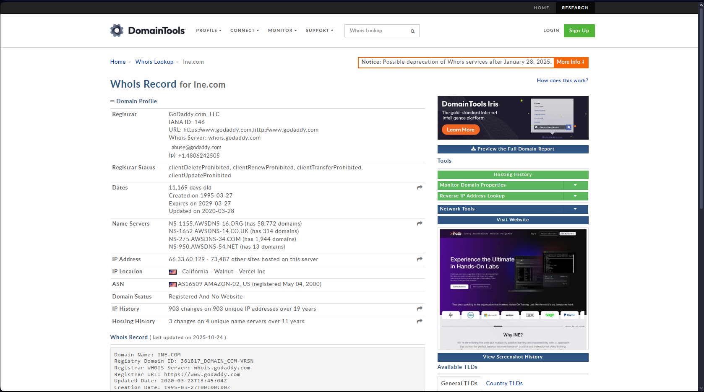

What is Information Gathering? It is the process of gathering information about your target using various tools or even doing a search for you online or on social media. 

Let's dive into this topic. 

This is the first phase of the hacker, and it is one of the most important phases because it is the one that will tell you which Target is vulnerable, what it uses, what system it is running on, and all the important information, and it is the first phase of the Cyber Kill Chain Model (CKCM).

We have 2 types of Reconnaissance, Passive and Active, of course, Passive is that I collect public information and the target does not even know that you are stealing from it or collecting information about it, but Active is that you contact the target through Port Scanning, through which we collect more information about the target, such as its systems, versions, and so on. 

https://www.exploit-db.com/ This site has an Exploit for some of the most important vulnerabilities available, and of course, as we all know, Metasploits get their datapaths from this site. 

In this model, we know only 6 ways to collect information, what are they? 

---

### The first one is Whois Information analysis

Whois is an online database that is available for anyone to access or obtain information from and use it against you.

What does this do or how does it happen? Basically, any website that is created when you go to register for this website on a specific domain, after you take the domain, the site you buy from this domain will ask you for some information such as your address, your number and so on, and this information becomes public, and of course this information can of course expose you to Social Engineering 

For example, a site like this one we use to collect information about Target https://who.is/ 

Here's another, better site: https://whois.domaintools.com/

As you can see, there's a lot of great information on this site. 

There is also a tool on Kali Linux called `Whois` that you can use as a Command Line 


As you can see, we can gather information using this tool. 

---

As Incident Response, how can we prevent this? 

Of course, these things are passive, meaning that I, as a user, do not know that anyone is collecting information about me at all, so my solution is to monitor my DNS Server in case any request is made to me, and there are Attacks on DNS and here are some Attacks on DNS that we can explain each of them in detail. 

https://www.paloaltonetworks.com/cyberpedia/what-is-a-dns-attack

There is a new service available on the Register websites where you buy a domain called Whois Privacy, which keeps your information hidden.

---

---

### The next thing is SSL Certificate Information Analysis

This is a type of attack that hackers use by analyzing your certificate and through it, he can, for example, draw a sketch of your network by knowing whether the certificate is issued for a single domain or subdomains, as well as which service you have, as well as critical assets, which are the important things that the certificate already protects, so by analyzing the certificate, I can find out which are the most important things and so on. 

Then we know the Host Name, IPs, and Alternatives DNS Server 

You're talking about the SSL Certificate, what is that? 

**SSL Certificate** (which stands for Secure Sockets Layer) is a certificate that makes the connection between the user and the website **encrypted and secure**.

This means that if someone logs on to your website and types in a password or credit card information, the data is **encrypted**, so even if someone spies on the network, they can't understand it.

Nowadays, SSL has become so essential that browsers (such as Chrome and Edge), if your site doesn't have SSL, a warning pops up saying "Site is not secure".

---

Okay, so which sites provide information about certificates and such? First, let's talk about something called Certificate Transparency 

**Certificate Transparency (CT)** is an initiative created to increase the security of SSL certificates. The idea is that any new SSL certificate that is issued should be recorded in a public registry that anyone can view. This will help detect certificates that have been issued accidentally or maliciously, and also expose CAs that may be behaving improperly.

Previously, information about certificates could only be found through **internet-wide scans**, which means scanning websites that are visible to the public. However, after the CT initiative, more information, including intranet hostnames that are supposed to be hidden, is now available.

This allows us to use Certificate Transparency records in **Passive Subdomain Enumeration**, meaning we can discover a company's subdomains without making any direct connection to them. For example, if you have a `company.com`domain `, you`can find certificates for:

`mail.company.com,` `vpn.company.com,` `dev-internal.company.` `com`

These names can give us an idea of the company's internal structure.

This topic is very useful in the **reconnaissance** or information gathering phase during a penetration test, and we can use sites like https://crt.sh/ or https://search.censys.io/to easily find these domains.


It is also useful in the Web Application Penetration Testing (WAPT) process by leaving a subdomain, for example, unprotected and so on because subdomains can be less secure 

Of course, as an incident Responder, I do exactly what a hacker would do and make sure that no important information is leaked or that there is no Internal Server that a hacker can get access to before the hacker eats you.

---

---

### Third Utilization of search engines, internet-wide scanners & other sites

This is through the Internet Scanner website that allows me to get information about the Target, such as Google Dorks. 

Here are some simple examples of Google Dorks 

**Search filters**

| **Filter** | **Description** | **Example** |
| --- | --- | --- |
| allintext | Searches for occurrences of all the keywords given. | `allintext:"keyword"` |
| intext | Searches for the occurrences of keywords all at once or one at a time. | `intext:"keyword"` |
| inurl | Searches for a URL matching one of the keywords. | `inurl:"keyword"` |
| allinurl | Searches for a URL matching all the keywords in the query. | `allinurl:"keyword"` |
| intitle | Searches for occurrences of keywords in title all or one. | `intitle:"keyword"` |
| allintitle | Searches for occurrences of keywords all at a time. | `allintitle:"keyword"` |
| site | Specifically searches that particular site and lists all the results for that site. | `site:"www.google.com"` |
| filetype | Searches for a particular filetype mentioned in the query. | `filetype:"pdf"` |
| link | Searches for external links to pages. | `link:"keyword"` |
| numrange | Used to locate specific numbers in your searches. | `numrange:321-325` |
| before/after | Used to search within a particular date range. | `filetype:pdf & (before:2000-01-01 after:2001-01-01)` |
| allinanchor (and also inanchor) | This shows sites which have the keyterms in links pointing to them, in order of the most links. | `inanchor:rat` |
| allinpostauthor (and also inpostauthor) | Exclusive to blog search, this one picks out blog posts that are written by specific individuals. | `allinpostauthor:"keyword"` |
| related | List web pages that are "similar" to a specified web page. | `related:www.google.com` |
| cache | Shows the version of the web page that Google has in its cache. | `cache:www.google.com` |

The ExploitDB repository's DataBase has a huge amount of Google Dorks https://www.exploit-db.com/google-hacking-database

---

How do we defend ourselves as an incident responder? I already do a search on myself and such, and this site helps us gather information about our site  https://osintframework.com/, so we analyze all these things in advance and try to minimize them https://osintframework.com/

In addition, https://web.archive.org/ is a site that provides a Snapshot of websites at certain times, which can help hackers a lot. 

This site is pretty cool and can give you some pretty good information about your Target. https://www.shodan.io/ We also agreed that we are doing Proactive Information Gathering, which means collecting information about myself. 

---

---

### Fourth is DNS interrogation

You can do DNS interrogation by doing a Dump of all DNS records, or you can do Zone Transfer, where you take a copy of every DNS record and record it to me. 

It works with tools like `nslookup or` `dig` 

This is an example of using the `dig` tool.


How do we prevent this? By preventing you from getting a Zone Transfer in the first place, which is done by the Adminstrator 

---

---

### Fifth Abusing Exposed OWA

What we're talking about here is **Active Reconnaissance** - gathering information in **a way that involves direct interaction with the target,**not just observing from afar like Passive Reconnaissance.

In this case, the attacker is exploiting a service called **Outlook Web Access (OWA** ) or the new **Outlook Web App**, a service that companies use to allow employees to access their emails from the browser.

The idea is that an attacker can find out the **name of** the company's **Active Directory Domain** (this is the name of the internal domain they use on the network, such as `corp.company.local`).

Knowing this name is very important for the attacker because then he can perform **Password Spraying Attack** - trying the same password on different computers, which minimizes the chance that the accounts will be locked or the attack will be detected.

---

There are two main methods that attackers use to discover the domain name from OWA 

1. **Exploiting Response Time variation:**
    
    When an attacker tries to log in with a wrong domain and a random username, the server responds relatively quickly because it knows that the domain is not its own.
    
    However, if he uses a real internal domain (even if the username is wrong), the server takes longer to respond because it is actually trying to verify the data with Active Directory.
    
    From this difference in response time, the attacker can determine that the domain he used is correct.
    
2. **Exploiting a weakness in NTLM over HTTP Authentication:**
    
    NTLM is a slightly outdated authentication method used by Microsoft, and when applied to HTTP (as in OWA), it has an "inefficiency" or design flaw that allows an attacker to infer certain information such as the domain name from the response or server interaction during the authentication process.
    

---

There is a tool used by hackers called Mail Sniper, and this tool is required to work in the Domain environment and can experiment with different emails and passwords until it is no longer needed. 

Example 

```powershell
Import-Module .\MailSniper.ps1
Invoke-DomainHarvestOWA–ExchHostname mail.domain.com –OutFile potential_domains.txt –CompanyName "Target Name"

```


How can we prevent this as an Incident Responder? This is done by limiting the number of devices that can access the Domain or limiting the number of attempts to avoid Brute Force.

---

---

### The sixth and final JavaScript Injection

**JavaScript injection** (usually via XSS) is not only used to exploit a user's session, it is also a powerful way to gather information about the target. The attack is simple: The attacker injects JavaScript code into an authoritative page, and when the victim opens the page, the code runs in their browser and can collect information and return it to the attacker. BEEF**(Browser Exploitation Framework** ) is a penetration testing tool that focuses on client-side attacks and uses JavaScript to collect information such as browser type, plugins, cookies, internal network, and even execute remote commands within the browser.

If a hacker uses an XSS-infected page to inject**malicious** JavaScript code into it, it can be downloaded to the user and collect information about them 

How do we as Incident Responder respond to this? By analyzing the packet with tools such as Wireshark and checking if there is any injected code or not, or by preventing XSS in the first place through filters in the backend and adding the CSP Header and Content Security Policy to prevent this attack in the first place. 

However, the hacker can make a tricky move and evade this code by doing Encoding of this script. 


Here is a link to the **malicious**  JavaScript code **that modifies cry** ptocurrencieshttps://www.fortinet.com/blog/threat-research/the-growing-trend-of-coin-miner-javascript-infection
